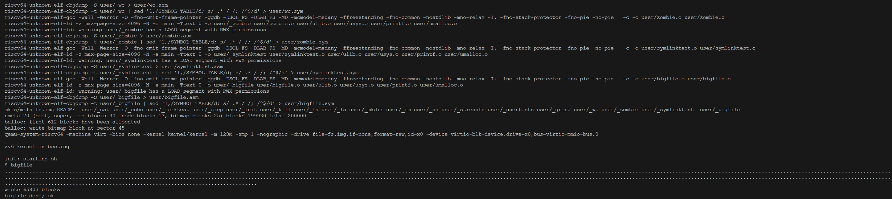
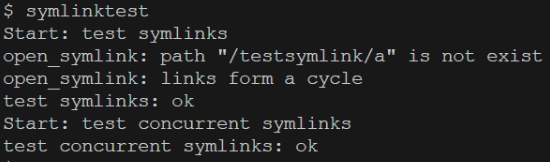
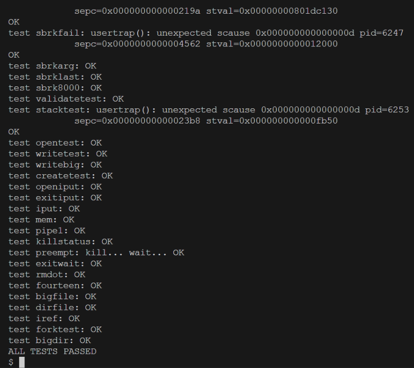
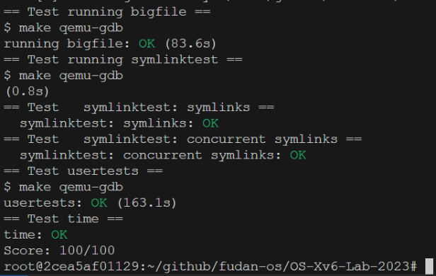

# 1. Experiment Details

## 1.1. Handling Large Files
### 1.1.1. Experimental Procedure

1. **Modify Data Block Structure:**
   - In `kernel/fs.h`, replace the direct data blocks with a two-level indirect data block scheme. This modification allows a single file to contain up to \(256 \times 256 + 256 + 11 = 65,803\) data blocks by changing the 12 direct blocks to 11 for dual indirect blocks.
   - Update the `dinode` and `inode` structures to ensure the number of elements remains consistent. After modification, the `addrs[]` array in the inode structure will have the first eleven entries as direct disk blocks, the twelfth as a single indirect block, and the thirteenth as a double indirect block:
     ```c
     #define NDIRECT 11
     #define NINDIRECT (BSIZE / sizeof(uint))
     #define NDBL_INDIRECT (NINDIRECT * NINDIRECT) // Double indirect blocks = single indirect blocks * single indirect blocks
     #define MAXFILE (NDIRECT + NINDIRECT + NDBL_INDIRECT)
     
     struct dinode
     {
       ...
       uint addrs[NDIRECT + 2]; // Addresses of data blocks
     };
     
     // `kernel/file.h`
     struct inode {
       ...
       uint addrs[NDIRECT + 2];
     };
     ```

2. **Update the `bmap()` Function in `kernel/fs.c`:**
   ```c
   static uint
   bmap(struct inode *ip, uint bn)
   {
     ......
   
     bn -= NINDIRECT; // Check double indirect blocks
     if (bn < NDBL_INDIRECT)
     {
       if ((addr = ip->addrs[NDIRECT + 1]) == 0) // Allocate a new double indirect block if it doesn't exist
       {
         addr = balloc(ip->dev);
         if (addr == 0)
           return 0;
         ip->addrs[NDIRECT + 1] = addr;
       }
       bp = bread(ip->dev, addr); // Read the double indirect block
       a = (uint *)bp->data;
       uint index1 = bn / NINDIRECT; // Calculate the first-level index to determine the index in the single indirect block array
       if ((addr = a[index1]) == 0)  // Allocate a new single indirect block if it doesn't exist
       {
         addr = balloc(ip->dev);
         if (addr == 0)
           return 0;
         a[index1] = addr; // Store the new address in the double indirect block
         log_write(bp);
       }
       brelse(bp);
       bp = bread(ip->dev, addr); // Read the single indirect block
       a = (uint *)bp->data;
   
       uint index2 = bn % NINDIRECT; // Calculate the second-level index
       if ((addr = a[index2]) == 0)
       {
         addr = balloc(ip->dev);
         if (addr == 0)
           return 0;
         a[index2] = addr;
         log_write(bp);
       }
       brelse(bp);
       return addr;
     }
     panic("bmap: out of range");
   }
   ```

3. **Ensure `itrunc()` Releases All File Blocks:**
   ```c
   void itrunc(struct inode *ip)
   {
     int i, j;
     struct buf *bp;
     uint *a;
   
     for (i = 0; i < NDIRECT; i++)
     {
       if (ip->addrs[i])
       {
         bfree(ip->dev, ip->addrs[i]);
         ip->addrs[i] = 0;
       }
     }
   
     if (ip->addrs[NDIRECT])
     {
       bp = bread(ip->dev, ip->addrs[NDIRECT]);
       a = (uint *)bp->data;
       for (j = 0; j < NINDIRECT; j++)
       {
         if (a[j])
           bfree(ip->dev, a[j]);
       }
       brelse(bp);
       bfree(ip->dev, ip->addrs[NDIRECT]);
       ip->addrs[NDIRECT] = 0;
     }
     if (ip->addrs[NDIRECT + 1]) // Release double indirect blocks
     {
       bp = bread(ip->dev, ip->addrs[NDIRECT + 1]); // Read the double indirect block
       a = (uint *)bp->data;
       for (i = 0; i < NINDIRECT; ++i)
       { // Iterate through each address in 'a', and if present, read the single indirect block and release data blocks
         if (a[i] == 0)
           continue;
         struct buf *bp2 = bread(ip->dev, a[i]);
         uint *b = (uint *)bp2->data;
         for (j = 0; j < NINDIRECT; ++j)
         {
           if (b[j])
             bfree(ip->dev, b[j]); // Free the data block
         }
         brelse(bp2);
         bfree(ip->dev, a[i]); // Free the single indirect block itself
         a[i] = 0;
       }
       brelse(bp);
       bfree(ip->dev, ip->addrs[NDIRECT + 1]); // Free the double indirect block
       ip->addrs[NDIRECT + 1] = 0;
     }
     ip->size = 0;
     iupdate(ip);
   }
   ```

### 1.1.2. Test Results


## 1.2. Implementing Symbolic Links
### 1.2.1. Experimental Procedure

1. **Define the `symlink` System Call:**
   ```c
   // `kernel/syscall.h`
   #define SYS_symlink  22
   
   // `kernel/syscall.c`
   extern uint64 sys_symlink(void);
   static uint64 (*syscalls[])(void) = {
     ...
     [SYS_symlink]   sys_symlink,
   };
   
   // `user/user.h`
   int symlink(char*, char*);
   
   // `user/usys.pl`
   entry("symlink");
   ```

2. **Add a New File Type for Symbolic Links in `kernel/stat.h`:**
   ```c
   #define T_SYMLINK 4   // Symbolic link 
   ```

3. **Introduce a New Flag in `kernel/fcntl.h` for Open System Call:**
   ```c
   #define O_NOFOLLOW 0x004    
   ```

4. **Implement the `sys_symlink()` Function in `kernel/sysfile.c`:**
   ```c
   uint64
   sys_symlink(void)
   {
     char target[MAXPATH], path[MAXPATH];
     struct inode *symlink_inode;
     int target_length;
     if ((target_length = argstr(0, target, MAXPATH)) < 0 || argstr(1, path, MAXPATH) < 0)
     { // Retrieve system call arguments
       return -1;
     }
     begin_op();                                    // Begin filesystem operation
     if ((symlink_inode = create(path, T_SYMLINK, 0, 0)) == 0) // Create a symbolic link inode with type T_SYMLINK
     {
       end_op();
       return -1;
     }
     if (writei(symlink_inode, 0, (uint64)target, 0, target_length) != target_length) // Write the target path into the symbolic link inode
     {
       iunlockput(symlink_inode);
       end_op();
       return -1;
     }
     iunlockput(symlink_inode); // Release the inode lock and end the filesystem operation
     end_op();
     return 0;
   }
   ```

5. **Modify the `sys_open()` Function in `kernel/sysfile.c` to Handle Symlinks:**
   ```c
     if (ip->type == T_SYMLINK && (omode & O_NOFOLLOW) == 0)
     {
       if ((ip = follow_symlink(ip)) == 0)
       {
         // No need to call iunlockput() here as follow_symlink() handles lock release on failure
         end_op();
         return -1;
       }
     }
   ```

6. **Define `NSYMLINK` in `kernel/fs.h` to Set Maximum Symlink Depth:**
   ```c
   #define NSYMLINK 10
   ```

7. **Implement the `follow_symlink()` Function in `kernel/sysfile.c`:**
   ```c
   static struct inode *follow_symlink(struct inode *ip)
   {
     uint inums[NSYMLINK]; // Allow up to NSYMLINK resolutions to prevent infinite loops
     int i, j;
     char target[MAXPATH];
   
     for (i = 0; i < NSYMLINK; ++i) // Iterate through symlink resolutions, tracking current inodes
     {
       inums[i] = ip->inum;
       if (readi(ip, 0, (uint64)target, 0, MAXPATH) <= 0) // Read the target path from the symbolic link file
       {
         iunlockput(ip);
         printf("open_symlink: failed to open symlink.\n");
         return 0;
       }
       iunlockput(ip);
       if ((ip = namei(target)) == 0) // Retrieve the inode of the target path
       {
         printf("open_symlink: path \"%s\" does not exist.\n", target);
         return 0;
       }
       for (j = 0; j <= i; ++j)
       { // Check for cycles by verifying if the current inode number has already been encountered
         if (ip->inum == inums[j])
         {
           printf("open_symlink: detected a cycle in links\n");
           return 0;
         }
       }
       ilock(ip);
       if (ip->type != T_SYMLINK)
       {
         return ip;
       }
     }
     // Exceeded maximum symlink resolution depth
     iunlockput(ip);
     printf("open_symlink: link depth exceeds the limit\n");
     return 0;
   }
   ```

### 1.2.2. Test Results




# 2. Reflections

## 2.1. Challenges Encountered and Solutions

- **Issue with `make qemu` Hanging at `init: starting sh`:**
  - **Problem:** When running `make qemu`, the process stalled before displaying `init: starting sh`.
  - **Solution:** After consulting with teaching assistants, it was identified that the issue was due to an incompatible newer version of QEMU. Downgrading QEMU to version 5.1 resolved the problem.

- **Function Implementation Order in `kernel/sysfile.c`:**
  - **Problem:** When implementing new functions in `sysfile.c`, particularly adding the `follow_symlink()` function, placing it after `sys_open()` caused an `implicit declaration of function` error.
  - **Solution:** Ensured that `follow_symlink()` was declared before its invocation in `sys_open()` to prevent such errors.

## 2.2. Overall Experience

This experiment provided a deeper understanding of the xv6 file system's internal data structures, such as the inode structure and block address arrays. I gained comprehensive insights into how xv6 manages file systems, including the organization of internal data structures and the fundamental processing workflows. Additionally, implementing support for symbolic links in xv6 enhanced my practical skills in modifying operating system components. I also learned to implement safeguards like limiting symlink resolution depth and cycle detection to ensure the system's stability and security, preventing infinite loops during symlink traversal.