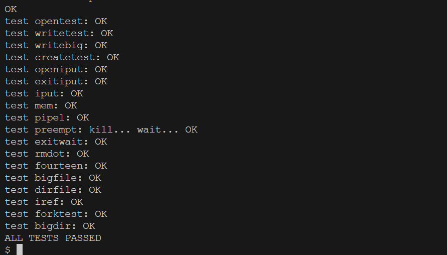

### 1. Experiment Objective  
The goal of the experiment is to redesign the memory allocator and disk buffer cache in the xv6 kernel by utilizing the provided locking mechanisms. This redesign aims to reduce contention in CPU memory allocation and disk cache management to improve overall system efficiency.

---

### 2. Experiment Process and Notes  

#### (1) Understanding the Memory Allocator (`kernel/kalloc.c`)  
- **Structure Overview:**  
  The `kmem` structure manages a single global free list for memory pages of 4096 bytes, protected by a spinlock.  
  - When allocating a page, it is removed from the free list's head.  
  - When freeing a page, it is added back to the free list's head.  
  - The spinlock ensures there are no race conditions during these operations.  

- **Function Analysis:**  
  - **`kinit`:** Initializes the spinlock for the free list and calls `freerange` to prepare memory pages between `end` and `PHYSTOP`.  
  - **`freerange`:** Iteratively splits memory into pages and adds them to the free list using `kfree`.  
  - **`kfree`:** Validates memory addresses, locks the free list, and inserts the page as a node into the list's head.

---

#### (2) Spinlock Implementation (`kernel/spinlock.c`)  
- **Structure Overview:**  
  The `spinlock` structure includes:  
  - A `locked` flag indicating if the lock is held.  
  - Debugging fields such as `name` (lock name) and `cpu` (holding CPU).  

- **Key Functions:**  
  - **`initlock`:** Initializes the lock and sets the `name` field.  
  - **`acquire`:** Implements the spinlock mechanism using the atomic operation `__sync_lock_test_and_set` to acquire the lock.  
    - Disables interrupts to avoid deadlocks.  
    - Uses memory barriers (`__sync_synchronize`) to prevent instruction reordering.

---

#### (3) Disk Buffer Cache (`kernel/bio.c`)  
- **Structure Overview:**  
  - The `bcache` structure contains a spinlock, an array of buffers, and a doubly linked list for managing buffers with an LRU (Least Recently Used) strategy.  
  - The `struct buf` structure holds metadata for the buffers, including references to the actual data.  

- **Key Functions:**  
  - **`binit`:** Initializes the buffer cache by constructing a circular doubly linked list of buffers.  
  - **`bread`:** Fetches a block into the cache, reading from disk if necessary.  
  - **`bget`:** Finds or allocates a buffer using the LRU strategy if a cache miss occurs.  

---

#### (4) Sleeplock Implementation (`kernel/sleeplock.c`)  
- **Structure Overview:**  
  - `sleeplock` contains a spinlock (`lk`), a `locked` flag, and fields for debugging such as `pid` (process ID).  

- **Key Functions:**  
  - **`acquiresleep`:** Acquires the lock by sleeping on a channel until it becomes available.  
  - **`sleep`:** Atomically releases the spinlock, puts the process to sleep, and reacquires the lock after being awakened.  

---

#### (5) Redesigning the Memory Allocator  
- **Enhancements:**  
  - Replaced the global free list with per-CPU free lists to reduce contention.  
  - Implemented a `steal_pages_from` function to allow CPUs to borrow pages from others when their free list is empty.  
  - Optimized locking to ensure safe, efficient operations across multiple CPUs.  

---

#### (6) Redesigning the Disk Buffer Cache  
- **Enhancements:**  
  - Added a hashing mechanism to divide the buffer cache into buckets, each protected by a separate spinlock.  
  - Allocated a fixed number of buffers to each bucket, simplifying buffer management and reducing contention.  
  - Adjusted functions such as `binit`, `bget`, and `brelse` to integrate the new bucket structure.
