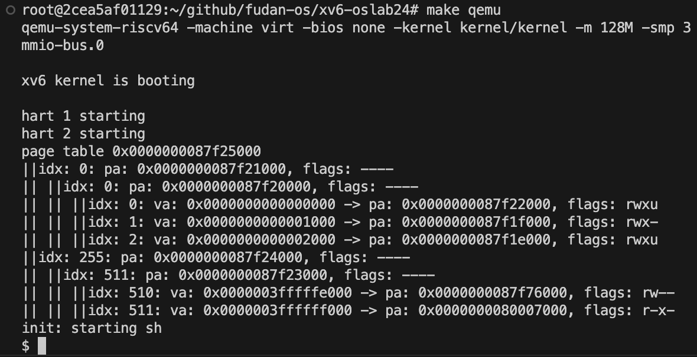
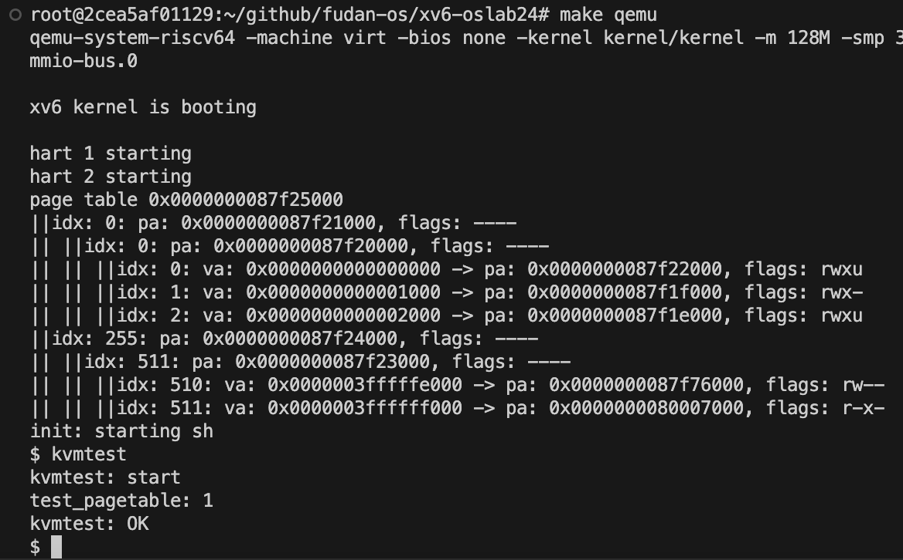
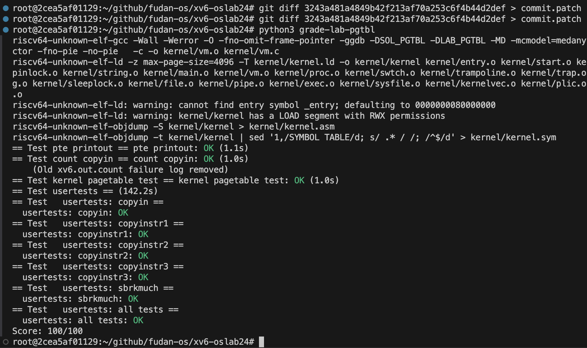

# Lab4 Page table 页表

## Part 1 | 打印页表

### Explanation

1. **Implement the `vmprint()` Function**:
   - Go to `kernel/vm.c` and implement the `vmprint()` function.
   - This function should recursively print the structure of the page table for a process, showing the mappings between virtual and physical addresses, as well as permission flags.

2. **Insert the Print Statement in `exec()`**:
   - In the `exec()` function, right before the `return argc` line, add the following condition:
     ```c
     if(p->pid == 1) vmprint(p->pagetable);
     ```
   - This will ensure that when the first process (with `pid = 1`) starts, the page table information will print.

3. **Define `vmprint()` in `defs.h`**:
   - Open `kernel/defs.h` and add the declaration for `vmprint()` so it can be used in `exec()`.
   
4. **Expected Output**:
   - When `xv6` boots, you should see a detailed log of the page table. Each level in the page table hierarchy (L2, L1, L0) is represented by `||`. Non-leaf nodes will display the physical address (`pa`) and permission flags, while leaf nodes show mappings from virtual addresses (`va`) to physical addresses (`pa`).

5. **Testing**:
   - Run `make grade` to execute tests that validate this output. The test should pass if your page table printing logic correctly matches the structure shown in the task description.

### Implementation

1. **`vmprint()` in `vm.c`:**
   - `vmprint()` recursively prints a page table's structure, including each page table entry (PTE) and the corresponding physical address, along with permission flags. This is used to display the memory mappings at startup for the first process, which helps in debugging.

   ```c
   void vmprint(pagetable_t pgtbl) {
       printf("page table %p\n", pgtbl);
       print_pgtbl(pgtbl, 0, 0L); // Recursive printing function
   }
   ```

2. **`print_pgtbl()` Function:**
   - This function iterates over each page table entry, checking if it is valid (`PTE_V` flag set). For each entry, it prints the virtual address (for leaf nodes), physical address, and permission flags (`rwxu`).
   - If an entry points to another page table (non-leaf node), `print_pgtbl()` is called recursively to print the next level.

   ```c
   void print_pgtbl(pagetable_t pgtbl, int depth, long virt) {
       for (int i = 0; i < 512; i++) {
           pte_t pte = pgtbl[i];
           if (pte & PTE_V) {
               uint64 pa = PTE2PA(pte);
               printf("idx: %d: pa: %p, flags: ...", i, pa);
               if ((pte & (PTE_R | PTE_W | PTE_X)) == 0) {
                   print_pgtbl((pagetable_t)pa, depth + 1, virt + i);
               }
           }
       }
   }
   ```

### Results



## Part 2 | 独立内核页表

### Explanation

1. **Modify `struct proc` in `proc.h`**:
   - Add two new members: `pagetable_t k_pagetable;` for the kernel page table, and `uint64 kstack_pa;` for the physical address of the kernel stack.

2. **Create a New Kernel Page Table Initialization Function**:
   - Write a new function, modeled after `kvminit()`, that creates a kernel page table for each process. Do not modify the global `kernel_pagetable` directly. This new function should return the kernel page table address for each process.

3. **Modify `procinit()`**:
   - Adjust `procinit()` to allocate the physical memory for the kernel stack and save this address in `kstack_pa`. The kernel stack should be mapped to the kernel page table later, in `allocproc()`, once the kernel page table for each process is created.

4. **Modify `allocproc()` to Set Up the Kernel Page Table**:
   - Inside `allocproc()`, call your new function to initialize each process’s kernel page table and map the kernel stack to this page table.

5. **Switch Kernel Page Tables in the Scheduler**:
   - Modify the scheduler to switch kernel page tables when switching between processes. When there’s no process to run, it should load the global `kernel_pagetable` into `satp`.
   - Use `w_satp()` and `sfence_vma()` to load the page table into the `satp` register and refresh the address mappings.

6. **Release the Page Table in `freeproc()`**:
   - In `freeproc()`, release the kernel page table for the process without freeing shared physical pages (e.g., those used by the kernel). Refer to `freewalk()` for managing page table traversal and freeing memory while preserving shared pages.

7. **Testing**:
   - Run `kvmtest` in `xv6` to verify independent kernel page tables. If implemented correctly, it will confirm the creation of independent page tables.
   - Then, run `usertests` to ensure all tests pass, confirming the functionality and correctness of the independent page tables.

### Implementation


1. **`procinit()` in `proc.c`:**
   - This function initializes each process’s kernel stack and sets up locks. Here, `kstack_pa` stores the physical address of the kernel stack for each process. The initial mappings in the global kernel page table (`kernel_pagetable`) are done by `kvmmap`.

   ```c
   void procinit(void) {
       for (p = proc; p < &proc[NPROC]; p++) {
           char *pa = kalloc();
           uint64 va = KSTACK((int)(p - proc));
           kvmmap(va, (uint64)pa, PGSIZE, PTE_R | PTE_W);
           p->kstack = va;
           p->kstack_pa = (uint64)pa;
       }
   }
   ```

2. **Creating Independent Kernel Page Tables with `kvminit_for_each_process`:**
   - The function `kvminit_for_each_process` creates a unique kernel page table (`k_pagetable`) for each process, mapping essential devices and kernel text but avoiding mappings like `CLINT` to avoid conflicts.

   ```c
   pagetable_t kvminit_for_each_process() {
       pagetable_t k_pagetable = (pagetable_t)kalloc();
       kvmmap_for_each_process(k_pagetable, UART0, UART0, PGSIZE, PTE_R | PTE_W);
       ...
       return k_pagetable;
   }
   ```

3. **Mapping Kernel Pages for Each Process with `kvmmap_for_each_process`:**
   - `kvmmap_for_each_process` is similar to `kvmmap` but operates on the process-specific kernel page table. It establishes mappings for memory regions critical to kernel operations.

   ```c
   void kvmmap_for_each_process(pagetable_t k_pagetable, uint64 va, uint64 pa, uint64 sz, int perm) {
       if (mappages(k_pagetable, va, sz, pa, perm) != 0) panic("kvmmap");
   }
   ```

4. **Setting Up Process Page Tables in `allocproc()`:**
   - In `allocproc`, `k_pagetable` is created by calling `kvminit_for_each_process()`. It maps the kernel stack for the process into `k_pagetable`.

   ```c
   static struct proc *allocproc(void) {
       p->k_pagetable = kvminit_for_each_process();
       kvmmap_for_each_process(p->k_pagetable, p->kstack, p->kstack_pa, PGSIZE, PTE_R | PTE_W);
   }
   ```

5. **Switching Page Tables in `scheduler`:**
   - The `scheduler()` function loads the independent kernel page table for each process into the `satp` register on context switches using `kvminithart_for_each_process`.

   ```c
   void scheduler(void) {
       for (p = proc; p < &proc[NPROC]; p++) {
           if (p->state == RUNNABLE) {
               kvminithart_for_each_process(p->k_pagetable);
               swtch(&c->context, &p->context);
               kvminithart(); // Load global page table when switching out
           }
       }
   }
   ```

6. **Freeing Page Tables in `freeproc()`:**
   - `freeproc` releases the memory associated with each process, including its `k_pagetable`. The `free_pagetable_except_for_leaf` function avoids releasing shared memory pages that multiple processes may reference.

   ```c
   static void freeproc(struct proc *p) {
       if (p->k_pagetable) {
           free_pagetable_except_for_leaf(p->k_pagetable);
       }
   }
   ```

### Results





## Questions

### 1. Translating the Virtual Address to a Physical Address under SV39

Under the SV39 standard, a 64-bit virtual address is split into several parts, following a hierarchical paging system that includes three levels of page tables: L2, L1, and L0. Here’s how to resolve the virtual address 0xFFFFFFE789ABCDEF to a physical address:

1. **Identify the Components of the Virtual Address**:
   The 64-bit virtual address is divided into three parts:
   - **VPN[2] (Level 2 Page Table Index)**: Bits 38-30 (9 bits)
   - **VPN[1] (Level 1 Page Table Index)**: Bits 29-21 (9 bits)
   - **VPN[0] (Level 0 Page Table Index)**: Bits 20-12 (9 bits)
   - **Page Offset**: Bits 11-0 (12 bits), used for the actual data location within the final physical page.

   For the address 0xFFFFFFE789ABCDEF, we would extract these bits to identify each level’s page table entry.

2. **Traverse the Page Tables**:
   - **Start at L2**: Use the VPN[2] (9 bits) to index into the L2 page table. This entry contains the physical address of the next level page table (L1).
   - **Go to L1**: Use VPN[1] to index into the L1 page table located at the physical address from the previous step. This entry then points to the L0 page table.
   - **Proceed to L0**: Use VPN[0] to index into the L0 page table. This final entry provides the base physical address of the page where our data resides.

3. **Calculate the Physical Address**:
   - The final physical address is obtained by combining the physical page address from the L0 table entry with the 12-bit page offset from the original virtual address. This results in the physical address where the data is located.

   For this specific virtual address (0xFFFFFFE789ABCDEF), each page table lookup requires assuming certain entries at each page level, which would provide the next-level page table address until we reach the final physical address.

---

### 2. Why are the L2, L1, and L0 Entries 9 Bits and Not 10 or 8?

In the SV39 standard, each level of page tables (L2, L1, and L0) uses a 9-bit entry. Here’s why this is necessary:

- **Page Directory Size Must Match Page Size**: In the SV39 architecture, each page table level (L2, L1, L0) occupies a single 4KB page. With 9-bit entries, each table can have \(2^9 = 512\) entries. Given that each page table entry is 8 bytes (64 bits), the size of a full page table with 512 entries is \(512 \times 8 = 4096\) bytes, which exactly matches the 4KB page size.

- **Cannot Use 10 or 8 Bits**: 
  - If each index were 10 bits, each page table would need \(2^{10} \times 8 = 8192\) bytes, exceeding the 4KB page size.
  - If each index were only 8 bits, each page table would occupy \(2^8 \times 8 = 2048\) bytes, only half of the 4KB page size, leading to inefficient memory usage.

Therefore, using 9 bits per level allows each page table to fill exactly one 4KB page, ensuring efficient and predictable memory usage.